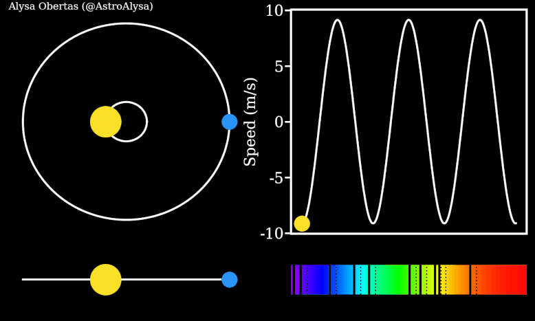
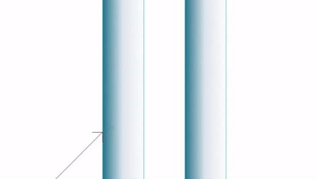
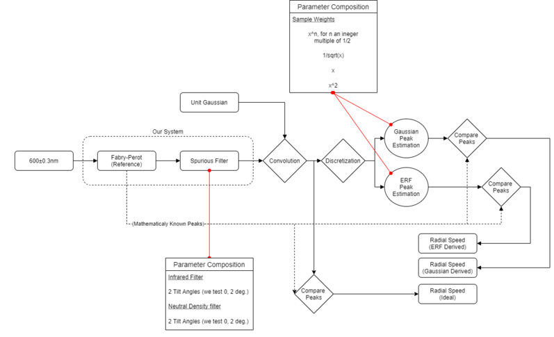
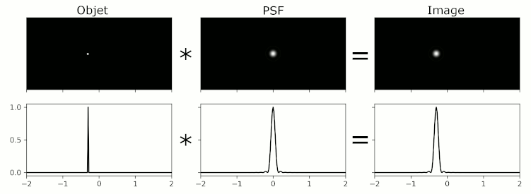

# Consoslidating data from the ESSPRESO sprectrograph
The search for exoplanets in astronomy requires especially precise equipment and measurement. Over stellar distances, the smallest errors can propagate into vastly different measurements.  
As such, great care must be taken at every step of the process. In the results of this thesis, we focus on how two specific processes affect the **radial speed** of planetary measurement. We look into the spurious effects of a Fabry-Perrot interferometer, and the effect of optical fibre geometry/material properties on wavelengths of Echelle-grated light.

More generaly, this concept of *radial speed* can be used as a metric to compare different types of systems. It is defined as:

$$\rho = \frac{\Delta\lambda_{sig}}{\lambda_{ref}}$$

In a general sense, it measures by what percentage a signal deviates from some reference.

The work can be divided into two sections:

- [Consoslidating data from the ESSPRESO sprectrograph](#consoslidating-data-from-the-esspreso-sprectrograph)
  - [Spurious effects on a Fabry-Perot interferometer](#spurious-effects-on-a-fabry-perot-interferometer)
    - [Context](#context)
    - [Implementation in Python](#implementation-in-python)
  - [Optical cabale light transfer from an Echelle grating](#optical-cabale-light-transfer-from-an-echelle-grating)
    - [Context](#context-1)

## Spurious effects on a Fabry-Perot interferometer

### Context
This is aimed at testing how different filters interfere with the 'ideal' output of a Fabry-Perot interferometer. A Fabry-Perot interferometer is an optical device used for measuring wavelengths of light, where it consists of two mirrors that form a resonant cavity. When light is incident on the mirrors, it is reflected back and forth, causing interference between the incident and reflected waves. The exiting rays form a circular interference pattern (peaks) on our detector. Normally used in interferometry, the resulting peaks can also serve as very fine optical references.

In real systems, the optical measurements get digitized for analytic purposes. Here we experiment with various filters and digital reconstruction methods in an attempt to curb spurious effects.
The architecture of the experiments is show in the following image:

We vary the parameters of different systems within systems. Below is a summary of the affected systems, and each indented bullet point represents which subsystem we also vary:
- The type of spurious filter(Infrared or Neutral Density)
  - the tilt angle
- The type of estimation method(ERF or Gaussian)
  - weight of each sample

Ultimately, we want to see how our reconstruction of the original Fabry-Perot peaks compare to the true, ideal ones.

The unit gaussian serves as a fixed transmittance function, which closely resembles the remaining optical setup (the rest of the setup was not deemed problematic).

### Implementation in Python

All the relevant code is in the [filter analysis](/filter-analysis/) folder. There is also a [deprecated](/filter-analysis/Deprecated-(but%20interesting)/) approach which does same, but using an `object oriented` approach. The latter was ultimately abandoned for development time reasons. There was no need for perfect repeatability once the results were produced.

The code is divided into two scripts: [fabry-perrot-toy.py](/filter-analysis/fabry-perrot-toy.py) and [OpticalSystems.py](/filter-analysis/OpticalSystems.py).
The latter defines most of the optical system related functions used by the former, and the former serves as the driver code where we actually run the experiments and see the results.

## Optical cabale light transfer from an Echelle grating

### Context
As light propagates through a telescope, many systematic errors can slowly pile up in the spectral domain. Of interest here, is the response of the telescope to different reference sources. In other words, how does the **Point Spread Function**(PSF) of the telescope interact with two references: a Fabry-Perot, and a Laser Frequency Comb?
